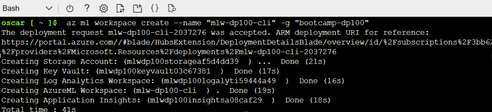

# Instructions

To create an Azure Machine Learning from the CLI, you can follow these instructions:

Open the Azure Cloud Shell in the Azure portal or install the Azure CLI in your terminal if you haven't already.

If you have the script.sh file, you can run it directly in the Azure Cloud Shell or copy and paste the commands line by line into your terminal. Before running the script or individual commands locally using az cli, make sure you are logged in to your Azure account using the `az login` command.

If you are using the Azure Cloud Shell, you can skip the installation of the Azure CLI as it is already pre-installed.

If you are using your own terminal, you can install the Azure CLI by following the instructions provided by Microsoft for your specific operating system.

Follow any prompts or provide necessary inputs as required during the execution of the script or individual commands.

After the execution is complete, you should have successfully created an Azure Machine Learning workspace.

Remember to review the script or individual commands before running them to ensure they align with your requirements and environment.